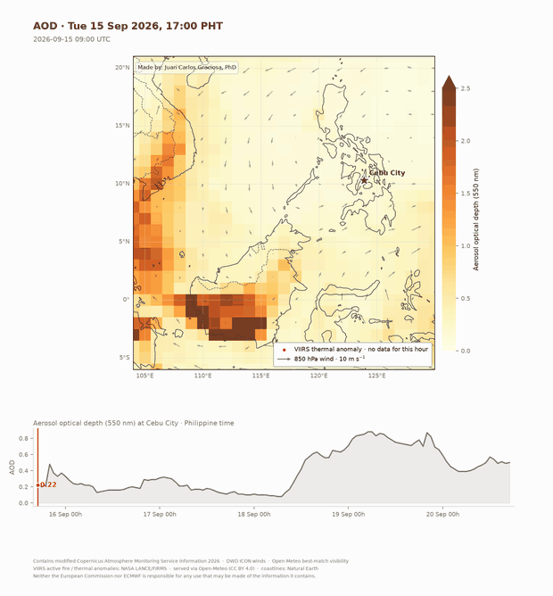

# Cebu haze source tracking

Traces where a particulate episode over Cebu City came from, using free,
mostly keyless data. Built for **episodic** attribution — a specific haze event,
retrospectively. Not chronic apportionment, not forecasting.

*1 Sep 2026: CAMS aerosol optical depth over NASA VIIRS true colour, with VIIRS
fire detections and the 120 h back-trajectory arriving at Cebu. The trajectory
lands in the Kalimantan fire complex ~2,000 km upwind.*

## Setup

    mamba env create -f environment.yml
    conda activate pollution-track-env

## Run

    python src/download.py                                    # a few minutes
    python src/plot_maps.py --var aerosol_optical_depth --basemap
    python src/make_gif.py  --var aerosol_optical_depth --basemap --fps 2

Useful variants:

    --var us_aqi          # AQI vs the measured station reading
    --var carbon_monoxide # sharpest smoke tracer
    --var sulphur_dioxide # volcanic / coal check
    --local               # zoom to the Visayas
    python src/download.py --parts vis,site      # refresh one stage only
    python src/trajectory.py 2026-09-01T00:00    # print one back-trajectory

## Layout

| path | role |
|---|---|
| `src/config.py` | domain, receptor, variables, colours, attribution |
| `src/download.py` | CAMS composition + AQI, ICON winds, VIIRS fire |
| `src/trajectory.py` | 850 hPa kinematic back-trajectories |
| `src/plot_maps.py` | one frame per time step + receptor strip |
| `src/make_gif.py` | frames → GIF (MP4 too, if ffmpeg is installed) |
| `src/compare_ground.py` | station pairing, per-hour bias factors |
| `src/plot_forecast.py` | 24 h PM outlook with the predictive band |
| `src/arl.py` | reader for NOAA ARL meteorology, the format HYSPLIT eats |
| `src/arl_cube.py` | ARL → regional cube in the project's npz layout |
| `src/soundings.py` | Mactan radiosondes (WMO 98646), cached |
| `src/residence.py` | 3D parcel residence in a control volume |
| `src/divergence.py` | spherical 3D divergence, cos(lat) metric carried |
| `src/smoke_flux.py` | integrated smoke transport from AOD and wind |
| `src/plot_replacement.py` | column mass budget: is the air stagnant? |
| `src/plot_flux_budget.py` | horizontal in, vertical out |
| `src/plot_inversion.py` | GFS inversion height against the soundings |
| `src/fetch_arl.sh` | resumable ARL download, refuses forecast-only files |

## Limits

- **Everything except the fire pixels is model output.** CAMS assimilates AOD,
  CO, NO₂, SO₂ and O₃, but not aerosol speciation or surface concentration.
- **CAMS understated this episode 2–3×.** Modelled peak was AQI 80 against
  AQI 172 at the DENR Talisay station. Use it for pattern, not for magnitude.
- **Trajectories are single-level with no vertical motion.** Fine for synoptic
  fetch; useless near Cebu, where the grid is coarser than the island. Use
  HYSPLIT for anything load-bearing.
- **Fires are a 24 h snapshot** without a free `FIRMS_MAP_KEY`, and are labelled
  as not time-resolved.
- **Visibility is not a haze tracer here** — 35 of its 41 km spread is diurnal,
  and correlation with AOD is only +0.19. Plottable, but don't read it as smoke.
- **`--basemap` imagery is a daily composite**, so it steps at midnight rather
  than animating, and the current day is patchy.
- **Open-Meteo rate-limits, and pressure levels only go back ~8 days.** A full
  1,184-point pull is thousands of billed calls; use `--parts`. The daily quota
  is real — we hit it, and the nightly job died on read timeouts as a result.
- **The air over Cebu was not stagnant.** Four independent tests say so: parcel
  residence 20.0 → 19.0 h, escape fraction 0.59 → 0.61, air mass flux unchanged
  to 1%, column turnover 5.6 → 4.7 h. The transport did not change; the load did.
- **Vertical exchange is the one mechanism still standing**, and it is not
  significant. One episode, effective n ≈ 5, p = 0.26. It needs a multi-episode
  study, which is what HYSPLIT's multi-year ARL archive is for.
- **GFS does not reproduce the observed inversion height.** Four definitions give
  correlations of −0.58 to +0.21 against 16 Mactan profiles. Bulk stratification
  agrees; the sharp step does not survive the model's vertical diffusion. For
  inversion structure, trust the sounding.
- **ARL `WWND` is dp/dt in hPa/s, negative upward** — not m/s. Convert with
  w = −ω/(ρg) or every vertical diagnostic comes out inverted and 10× wrong.

## Attribution

Figures carry these; keep them if you reuse the outputs.

- **CAMS** — "Contains modified Copernicus Atmosphere Monitoring Service
  information [year]" plus "Neither the European Commission nor ECMWF is
  responsible for any use that may be made of the information it contains"
  ([licence](https://apps.ecmwf.int/datasets/licences/cams))
- **Winds** — DWD ICON, pinned in `config.py`. Don't leave Open-Meteo on
  `best_match`: it resolved to ICON here, but ICON and GFS differ ~10° in
  850 hPa direction, which moves a 5-day trajectory by hundreds of km.
- **Open-Meteo** (CC BY 4.0) · **NASA LANCE/FIRMS** · **NASA Worldview/GIBS**
  · **Natural Earth**
